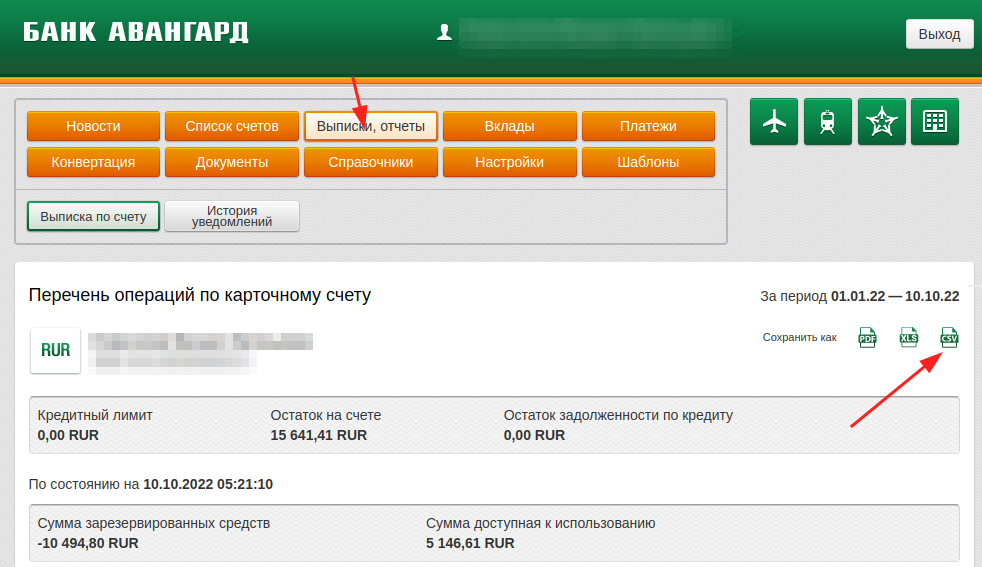
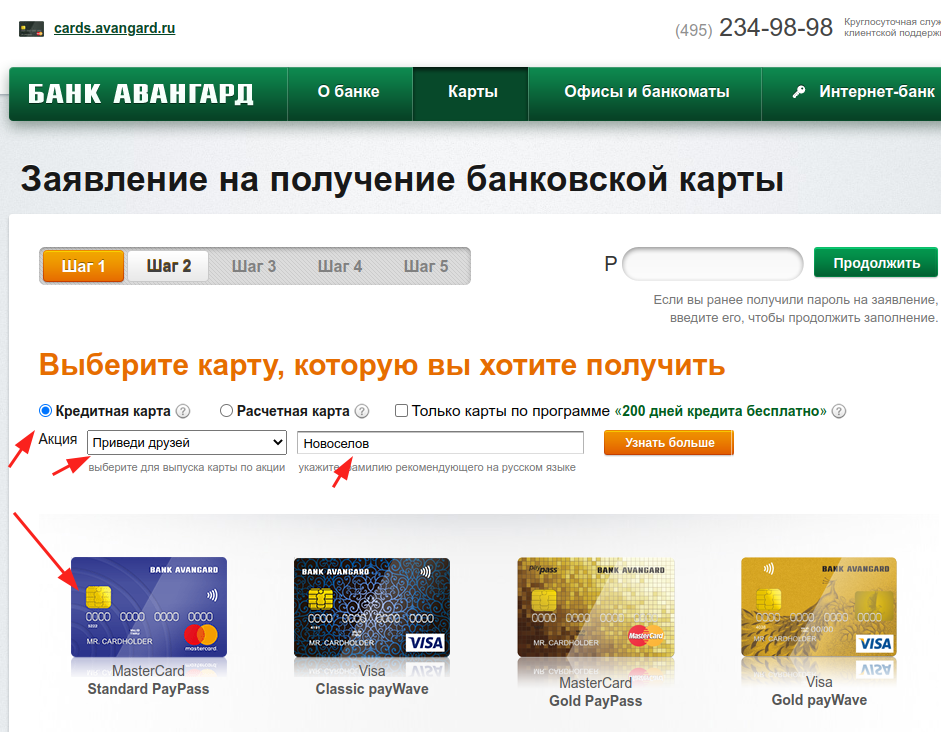

# Сколько кешбека можно было бы получить в банке Авангард

Этот простой bash-скрипт берет выгрузку истории платежей по карте из банка Авангард и смотрит, по каким из них был бы начислен кешбек, а по каким нет.

Автор 4 года активно использовал карту без кешбека и решил посчитать, что было бы, если бы использовал карту с кешбеком.

В начале скрипта перечислены MCC-коды операций, по которым не начисляется кешбек согласно [условиям](https://avangard.ru/rus/private/cards/exclbonusworld/) по карте [Mastercard World Cash Back](https://avangard.ru/rus/private/cards/salecard/world_mc_cashback/).

## Инструкция

Для работы необходимы bash и bc.

1. Выгрузите историю операций в интернет-банке в CSV:

Банк Авангард хорош в том числе тем, что позволяет выгрузить историю за большой период (за 4 года спокойно спокойно, больше — не пробовал) одним запросом. Это помимо вообще самого наличия выгрузки в csv с MCC, стабильной работы, отсутствия навязывания продуктов и услуг, удобных нетяжелых приложений и интернет-банка, стретч-карты как замены SMS-кодов и Avangard Pay на случай потери телефона, низких комиссий, быстрых ответов по телефону без общения с ботами и т.д.

На скриншоте ниже показано, как сделать выгрузку.



2. Запустите скрипт:

`./avangard-mcc.sh "путь к файлу.csv"`

Пример вывода:

```
Всего: 375912 руб, 375912 операций
Попадает под кешбек: 215355 руб, 412 операций
Не попадает под кешбек: 160557 руб, 160557 операций
Доля попавших под кешбек средств: 57.28867394496584306900%
Доля попавших под кешбек операций: .10960011917682861900%
```

Если нужно вывести попавшие под кешбек операции, то установите переменную окружения `PRINT_CASHEDBACK=1`, например:

`PRINT_CASHEDBACK=1 ./avangard-mcc.sh "путь к файлу.csv"`

Файл `example.csv` служит примером выгрузки.

## Карта Авангарда бесплатно

Изначально не планировал выкладывать этот скрипт, но, раз выложил, напишу, как можно получить карту Авангарда бесплатно. В [акции](https://cards.avangard.ru/friends/) почему-то участвуют только кредитные карты. Вы можете оформить кредитную карту и пользоваться ею, как расчетной, не беря в долг. Выпуск и обслуживание карты для вас будут бесплатными, а мне "капнут" бонусные мили на покупку ж/д и авиа-билетов.

Оформите заявку по ссылке: [https://www.avangard.ru/ccorder/v2/](https://www.avangard.ru/ccorder/v2/)

Выберите кредитную карту, программу "Приведи друга", укажите фамилию "Новоселов". Как закончите оформление заявки, напишите ее ID мне на почту m@mikhailnov.ru, я должен буду ее ввести в интернет-банке.

Карты "Мир" не бесплатны, Mastercard Standard будет бесплатной, если отказаться от "200 дней кредита без процентов". Сейчас оплату за транзакции по Mastercard и Visa получает та же НСПК, что и за "Мир", так что использование Mastercard, думаю, не является финансированием иностранных структур.


